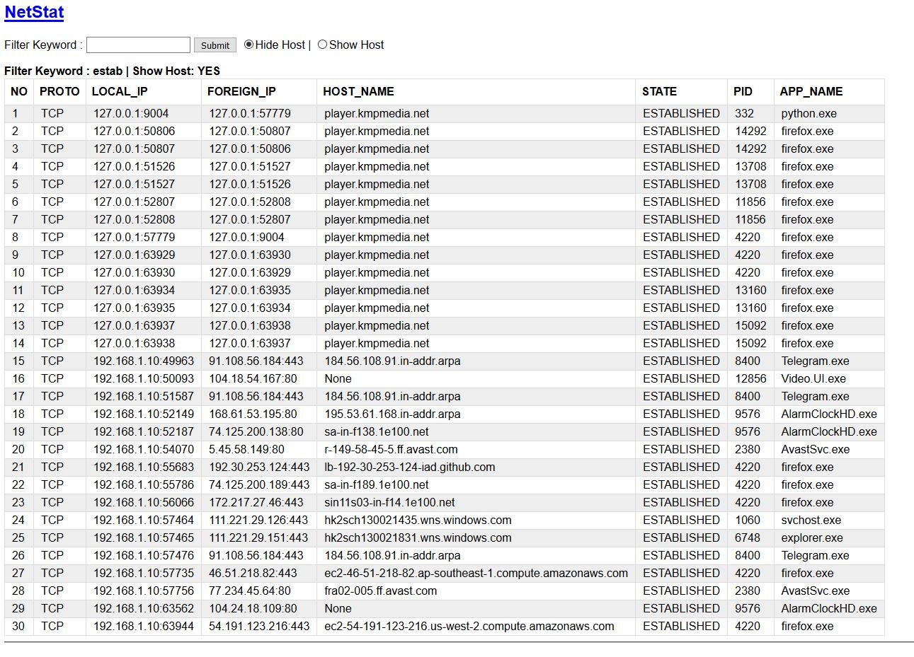
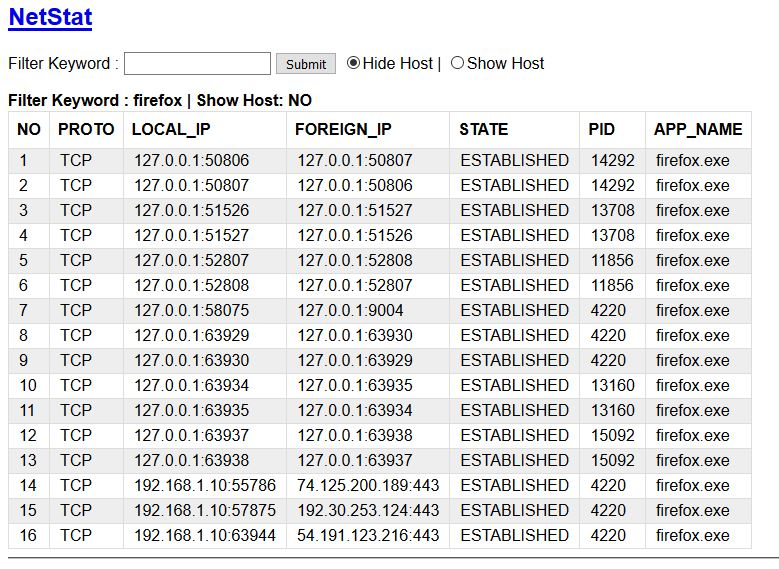

## TENTANG TOOL INI 
Tool/Script ini adlah tool untuk melihat aktifitas koneksi dan port yang terbuka menggunakan netstat 
yang dieksekusi menggunakan python-CGI (WEB based) untuk mendapatkan format output yang sesuai dengan keinginan, 
dilengkapi dengan filter yang lebih memudahkan.

## SCREENSHOT 
1.	Screenshot dengan menggunakan filter 'estab', menampilkan semua yang mengandung kata tersebut :  

2.	Screenshot dengan menggunakan filter 'firefox', menampilkan semua yang mengandung kata tersebut :  

## HOW TO 
*	How to ini hanya berlaku untuk yang sudah terbiasa dengan python di sistem operasi windows, 
	diasumsikan semua perangkat yang dibutuhkan udah tersedia seperti, python 3 udah terinstall dll...
1.	copy, download atau clone semua script diatas
2.	click file `start-server.bat` untuk menjalankan server dari direktori yang lagi aktif
3.	buka `browser` dan ketik alamat url : `http://localhost:9004/cgi-bin/index.py` atau `http://localhost:9004/cgi-bin/netstat.py`
4.	lakukan filter dengan menggunakan kata kunci tertentu, contoh `fire` seperti contoh pada screenshot.